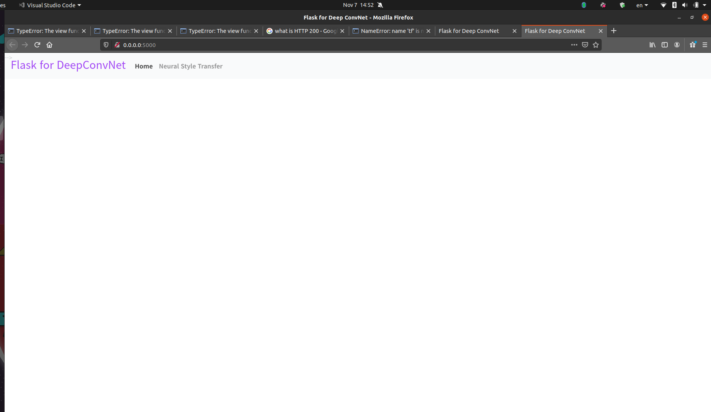
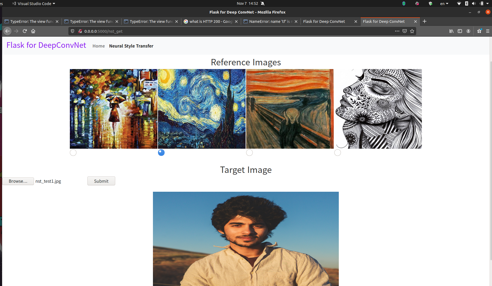

## Neural Style Transfer

The Neural-Style-Transfer file in does the following:
- Sets up a network to calculate the layer activation of VGG19 for the style reference image, target iamge and generated image.
- Define the loss of ceontent and loss of style functions using layer activation calcualted from three images. IMplemented by minimizing this loss
- Set the gradient descent process to minimize the loss function.

To run Follow these steps:

1. `python -m virtualenv venv`
2. `pip install -r requirements.txt`
3. `python flask_app.py`

4. In a browser open `https://localhost:0.0.0.0`

## Current Outlook

